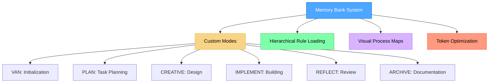
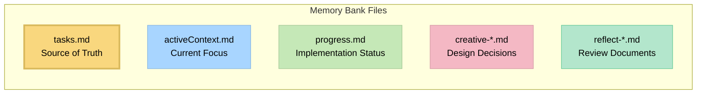

# Memory Bank System v0.7-beta

## A Message from the Creator

Hey everyone! 👋

When I built cursor-memory-bank, it was my personal project to solve a problem I faced daily as a software engineer. With extensive experience in the field, I knew there had to be a better way to harness AI for actual development work.

Your **2,400+ stars** and incredible feedback proved this vision resonated - but also showed me what I was really after wasn't just setup tools. **I wanted working prototypes.**

So I went back to my software engineering roots and built something that delivers on the original promise: **Three-Tier Orchestration Architecture** that uses advanced prompt engineering and specialized agents to handle all the heavy lifting - from natural language request to browser-tested application.

**What cursor-memory-bank started as my personal solution, this completes:**
- Say "implement this PRD.md" → Get complete project breakdown with TaskMaster coordination
- Say "build a user management system with RBAC" → Get 5-tier role hierarchy with 28 permissions
- Say "create an e-commerce platform" → Get product catalog, cart, checkout, and payment integration
- Say "add real-time collaboration features" → Get WebSocket implementation with conflict resolution

Drawing on my engineering experience, the new system addresses major limitations while keeping the same core vision: **AI that actually builds working software.** As we discover new challenges, we add specialized agents to keep evolving the system.

cursor-memory-bank will stay here as the foundation that made this possible. But if you want to see where my engineering journey leads, check out the evolution:

**👉 [Claude Code Sub-Agent Collective](https://github.com/vanzan01/claude-code-sub-agent-collective)**

Thank you for making my personal project a success. The future is even more exciting! 🚀

*- vanzan*

---

A token-optimized, hierarchical task management system that integrates with Cursor custom modes for efficient development workflows.



> **Personal Note**: Memory Bank is my personal hobby project that I develop for my own use in coding projects. As this is a personal project, I don't maintain an issues tracker or actively collect feedback. However, if you're using these rules and encounter issues, one of the great advantages is that you can ask the Cursor AI directly to modify or update the rules to better suit your specific workflow. The system is designed to be adaptable by the AI, allowing you to customize it for your own needs without requiring external support.

## About Memory Bank

Memory Bank is a personal project that provides a structured approach to development using specialized modes for different phases of the development process. It uses a hierarchical rule loading architecture that loads only the rules needed for each phase, optimizing token usage and providing tailored guidance.

### Token-Optimized Architecture

Version 0.7-beta introduces significant token optimization improvements:

- **Hierarchical Rule Loading**: Only loads essential rules initially with specialized lazy-loading
- **Progressive Documentation**: Implements concise templates that scale with task complexity
- **Optimized Mode Transitions**: Preserves critical context efficiently between modes
- **Level-Specific Workflows**: Adapts documentation requirements to task complexity

See the [Memory Bank Optimizations](MEMORY_BANK_OPTIMIZATIONS.md) document for detailed information about all optimization approaches.

### Beyond Basic Custom Modes

While Cursor's documentation describes custom modes as primarily standalone configurations with basic prompts and tool selections, Memory Bank significantly extends this concept:

- **Graph-Based Mode Integration**: Modes are interconnected nodes in a development workflow rather than isolated tools
- **Workflow Progression**: Modes are designed to transition from one to another in a logical sequence (VAN → PLAN → CREATIVE → IMPLEMENT → REFLECT → ARCHIVE)
- **Shared Memory**: Persistent state maintained across mode transitions via Memory Bank files
- **Adaptive Behavior**: Each mode adjusts its recommendations based on project complexity
- **Built-in QA Functions**: QA capabilities can be called from any mode for technical validation

This approach transforms custom modes from simple AI personalities into components of a coordinated development system with specialized phases working together.

### CREATIVE Mode and Claude's "Think" Tool

The CREATIVE mode in Memory Bank is conceptually based on Anthropic's Claude "Think" tool methodology, as described in their [engineering blog](https://www.anthropic.com/engineering/claude-think-tool). The v0.7-beta implements an optimized version with:

- Progressive documentation with tabular option comparison
- "Detail-on-demand" approach that preserves token efficiency
- Structured templates that scale with complexity level
- Efficient context preservation for implementation phases

For a detailed explanation of how Memory Bank implements these principles, see the [CREATIVE Mode and Claude's "Think" Tool](creative_mode_think_tool.md) document.

## Key Features

- **Hierarchical Rule Loading**: Load only the essential rules with specialized lazy-loading
- **Progressive Documentation**: Concise templates that scale with task complexity
- **Unified Context Transfer**: Efficient context preservation between modes
- **Mode-Specific Visual Maps**: Clear visual representations for each development phase
- **Level-Specific Workflows**: Adapted processes based on complexity (Levels 1-4)
- **Platform-Aware Commands**: Automatically adapts commands to your operating system

## Installation Instructions

### Prerequisites

- **Cursor Editor**: Version 0.48 or higher is required.
- **AI Model**: Claude 4 Sonnet or Claude 4 Opus is recommended for best results.

### Step 1: Get the Files

Simply clone this repository into your project directory:

```
git clone https://github.com/vanzan01/cursor-memory-bank.git
```

#### Alternative (Manual)

After extracting it from the ZIP file, follow the steps below.

- Copy the `.cursor` folder to the project directory

Note: other documents are not necessary for memory bank operation, they are explanatory documents. You can copy them to a folder like `memory_bank_documents`.

### Step 2: Verification

Ensure that the `.cursor/rules` folder is present in your project root. This folder contains the `.mdc` rule files that power the Memory Bank system.

Cursor will automatically detect these rules. No further configuration is required.

## Usage

The new system leverages **Cursor Project Rules** to automatically load the necessary context and instructions based on your commands.

1. **Initialize the Project**:
   - Open a new chat in Cursor.
   - Type **"VAN"** (or "Initialize Memory Bank").
   - The system will load the initialization rules, analyze your project, and determine the complexity level.

2. **Follow the Workflow**:
   - Based on the complexity analysis, the system will guide you through the appropriate phases:
     - **PLAN**: Type "PLAN" to create an implementation plan.
     - **CREATIVE**: Type "CREATIVE" to enter the design phase.
     - **IMPLEMENT**: Type "IMPLEMENT" to start coding.
     - **REFLECT**: Type "REFLECT" to review work.
     - **ARCHIVE**: Type "ARCHIVE" to finalize documentation.

3. **Technical Validation (QA)**:
   - At any time, type **"QA"** to run technical checks and validation.

### Mode Aliases

You can use these keywords to trigger specific modes:

- `/van` or `VAN`: Initialization Mode
- `/plan` or `PLAN`: Planning Mode
- `/creative` or `CREATIVE`: Creative Design Mode
- `/act` or `IMPLEMENT`: Implementation Mode
- `/reflect` or `REFLECT`: Reflection Mode

## Core Files and Their Purposes

### QA Functionality

QA is not a separate custom mode but rather a set of validation functions that can be called from any mode. You can invoke QA capabilities by typing "QA" in any mode when you need to perform technical validation. This approach provides flexibility to conduct verification at any point in the development process.

## Usage

The system is designed to be intuitive. Instead of manually switching modes, you simply interact with the AI using standard commands.

### Workflow Overview

1. **Start with VAN Mode**:
   - Type "VAN" to initiate the initialization process
   - VAN will analyze your project structure and determine complexity

2. **Follow the Workflow Based on Complexity**:
   - **Level 1 tasks**: May proceed directly to IMPLEMENT after VAN
   - **Level 2 tasks**: Simplified workflow (VAN → PLAN → IMPLEMENT → REFLECT)
   - **Level 3-4 tasks**: Full workflow (VAN → PLAN → CREATIVE → IMPLEMENT → REFLECT → ARCHIVE)
   - **At any point**: Type "QA" to perform technical validation


      

3. **Mode-Specific Commands**:
   The system recognizes these keywords to load the appropriate rules and context:

   - **VAN**: Initialize project and determine complexity
   - **PLAN**: Create detailed implementation plan
   - **CREATIVE**: Explore design options for complex components
   - **IMPLEMENT** (or `/act`): Systematically build planned components
   - **REFLECT**: Review and document lessons learned
   - **ARCHIVE**: Create comprehensive documentation
   - **QA**: Validate technical implementation

4. **Starting to work with your project**:
   
   After successfully installing Memory Bank, simply open a chat and type **"VAN"** to begin.

## Core Files and Their Purposes



- **tasks.md**: Central source of truth for task tracking
- **activeContext.md**: Maintains focus of current development phase
- **progress.md**: Tracks implementation status
- **creative-*.md**: Design decision documents generated during CREATIVE mode
- **reflect-*.md**: Review documents created during REFLECT mode

## Troubleshooting

### Common Issues

1. **Rules not loading**:
   - Ensure the `.cursor` folder is in the root of your project.
   - Verify that `.cursor/rules` contains the `.mdc` files.
   - Try explicitly mentioning the mode name (e.g., "Switch to PLAN mode").

2. **Command execution issues**:
   - Ensure you're running commands from the correct directory
   - Verify platform-specific commands are being used correctly

## Version Information

This is version v0.7-beta of the Memory Bank system. It introduces significant token optimization improvements over v0.6-beta while maintaining all functionality. See the [Release Notes](RELEASE_NOTES.md) for detailed information about the changes.

### Ongoing Development

The Memory Bank system is actively being developed and improved. Key points to understand:

- **Work in Progress**: This is a beta version with ongoing development. Expect regular updates, optimizations, and new features.
- **Feature Optimization**: The modular architecture enables continuous refinement without breaking existing functionality.
- **Previous Version Available**: If you prefer the stability of the previous version (v0.1-legacy), you can continue using it while this version matures.
- **Architectural Benefits**: Before deciding which version to use, please read the [Memory Bank Upgrade Guide](memory_bank_upgrade_guide.md) to understand the significant benefits of the new architecture.

## Resources

- [Memory Bank Optimizations](MEMORY_BANK_OPTIMIZATIONS.md) - Detailed overview of token efficiency improvements
- [Release Notes](RELEASE_NOTES.md) - Information about the latest changes
- [Cursor Custom Modes Documentation](https://docs.cursor.com/chat/custom-modes)
- [Memory Bank Upgrade Guide](memory_bank_upgrade_guide.md)
- [CREATIVE Mode and Claude's "Think" Tool](creative_mode_think_tool.md)
- Mode-specific instruction files in the `.cursor/commands/` directory

---

*Note: This README is for v0.7-beta and subject to change as the system evolves.*
